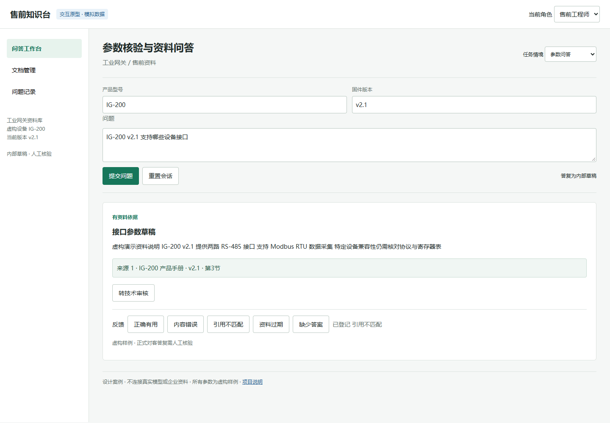

# 工业设备售前知识库助手：产品设计案例

把产品手册、接口说明和售后规则转化为有出处的内部答复，帮助售前人员核对技术参数。重点不是让模型多说，而是确定什么时候可以答、什么时候必须补问或交给工程师。

**性质：自主设计案例，不是真实客户项目。** 场景、人员、设备与资料均为虚构；未开展企业访谈、部署真实 RAG 服务或测得业务提升。竞品结论来自公开官方文档，原型为确定性模拟，无 API 调用。文档中的门槛是待验证的设计目标，不是测试成绩。

## 从这里看

| 交付物 | 内容 |
| --- | --- |
| [需求分析](docs/01-discovery.md) | 问题假设、用户任务、访谈提纲、MVP取舍 |
| [竞品与决策](docs/02-competitive-analysis.md) | Dify、FastGPT公开文档对照，选型边界与来源 |
| [PRD](docs/03-prd.md) | 角色权限、功能规则、状态、异常、接口契约 |
| [评测与试点](docs/04-evaluation.md) | 指标定义、标注方式、灰度与停止条件 |
| [售前与交付](docs/05-presales-delivery.md) | 演示脚本、需求确认、部署检查和ROI口径 |
| [验收用例](data/acceptance-cases.csv) | 20个设计用例；通过标准，不是实测结果 |
| [可点击原型](prototype/index.html) | 问答、引用、反馈、工单、文档状态和权限分支 |
| [面试讲解](docs/06-walkthrough.md) | 3分钟介绍、取舍、待验证问题 |

## 打开原型

下载仓库，直接在浏览器打开 `prototype/index.html`，无需安装、启动服务器或填写密钥。GitHub文件预览不会执行HTML。

原型顶部可选择任务情境；问答页可修改问题并提交，查看引用、登记反馈、生成本地工单，文档页可模拟文件导入和重试。界面所有设备参数都是虚构样例，不得用于真实设备操作。刷新页面会重置会话数据。

该原型不提供身份认证、文档解析、向量检索、模型生成和后台存储。角色切换仅用于演示权限需求，不是安全控制。与真正系统之间的差距在PRD和交付清单中列出。

## 核心取舍

1. 先内部辅助，暂不直接向客户自动发送答复。
2. 先保证引用和参数版本可核验，再考虑开放式生成。
3. 权限必须在后端、检索前落实，不能只隐藏页面内容。
4. 首期不做订单写入、自动报价、设备控制和自主Agent。
5. 先做离线对照与小范围人工审核，再讨论A/B实验。

## 原型预览与验证



原型在桌面、平板及390px移动视口检查布局；浏览器自动化检查7个问答状态、引用打开、反馈、工单登记、角色分支、文件导入、重试和切换场景取消迟到结果。此类检查不替代PRD中后台安全与生产验收。

文档完整性检查使用标准库，无需第三方依赖：

```bash
python -m unittest discover -s tests -v
```

仓库CI会检查本目录文档链接、20条验收记录结构、原型状态及不调用网络的边界。

文档编写于2026-10-05，公开资料查阅日期同日。后续应根据版本和真实调研更新。本目录继承仓库MIT许可证。
